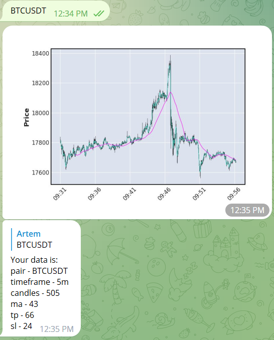

# Crypto telegram bot

## Іnstallation
```
git clone https://github.com/AVyha/crypto_telegram_bot.git
python -m venv venv
venv\Scripts\activate
pip install -r requirements.txt
```

## How to use

Create `.env` file and set yours telegram bot token how it in example `.env_example`

Write pair for trade. For example try `BTCUSDT` or `YFIUSDT`

## Example




